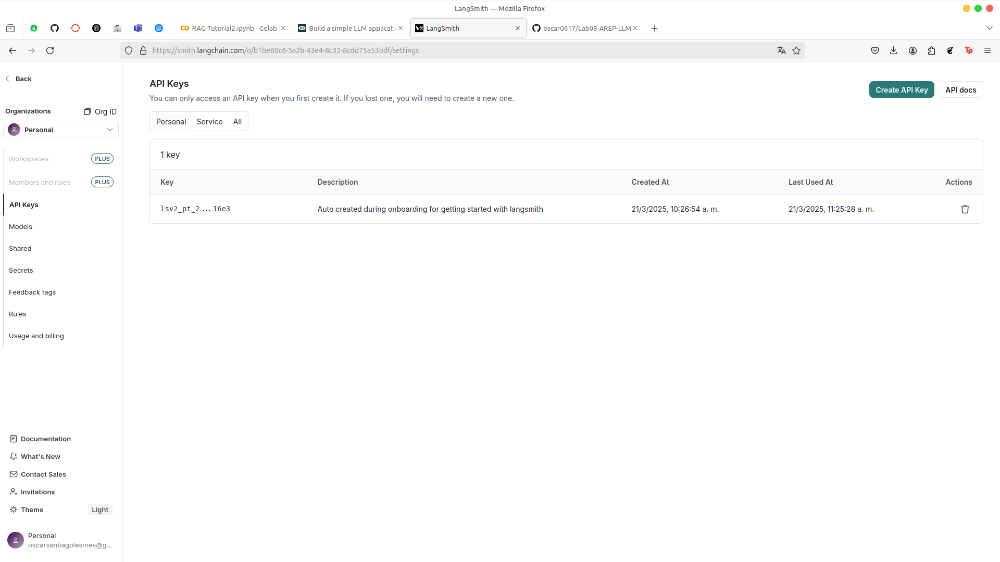
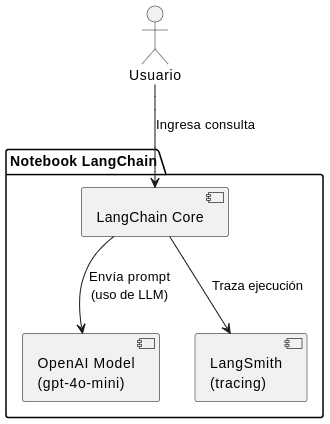
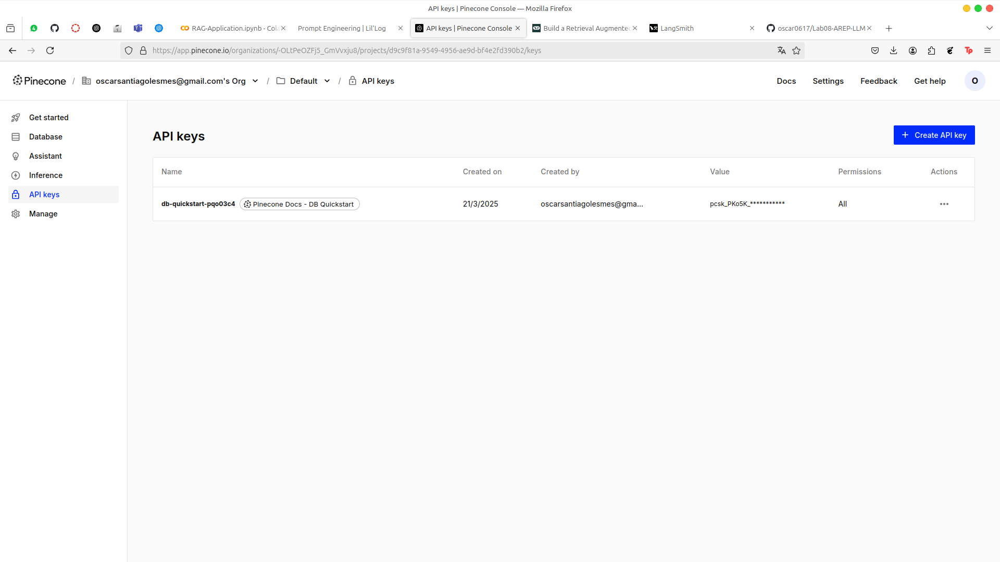
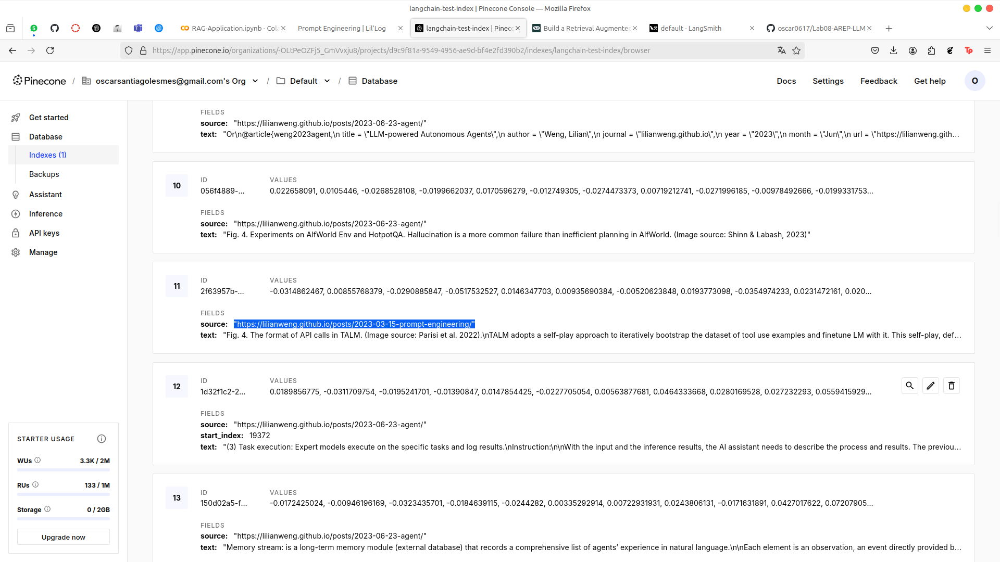
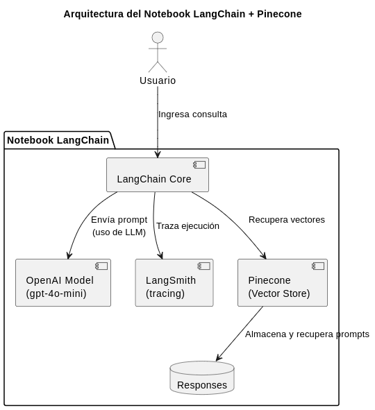

# LLM's
 
In this reposiroty you'll find how to create a response from an AI model (in this case OPEN AI 4o-mini from chat gpt), and a mini project for a RAG.

---

## Tutorial 

## Getting Started

These instructions will get you a copy of the project up and running on your local machine for development and testing purposes.

### Prerequisites

You need to install the following tools to run the project:
1. Python
    ```
    python --version
    ```
    It should appear something like this:
    ```
    Python 3.9.7
    ```
2. Git
    ```
    git --version
    ```
    It should appear something like this:
    ```
    git version 2.44.0
    ```
## Dependencies

To run this project you have to create a venv on python. And install this dependencies:
   ```
python3 -m venv venv
source venv/bin/activate

pip install langchain
pip install -qU "langchain[openai]"

```

## API KEYS

To run this notebook you have to create a few API keys on LangSmith and OpenAI.



For OpenAI, I'm using the key provided by the teacher

### Installing locally

1. Clone this repository and go to project directory:
    ```
    git clone https://github.com/oscar0617/Lab08-AREP-LLM

    cd Lab08-AREP-LLM
    ```
2. Open `LangLLM Tutorial.ipynb`

In this file you will find how the application works following the tutorial described on https://python.langchain.com/docs/tutorials/llm_chain/


## Architecture



#### Overview
This diagram illustrates the architecture of a LangChain-based notebook, integrating OpenAI and LangSmith for AI-driven text processing and execution tracing.

## Components

1. User  
   - The user interacts with the system by submitting a query.

2. Notebook LangChain  
   - A structured environment where LangChain operates.

3. LangChain Core  
   - The main processing unit that handles user requests.

4. OpenAI Model (GPT-4o-mini)  
   - LangChain sends a prompt to OpenAI to generate a response.

5. LangSmith (Tracing)  
   - LangChain traces execution to facilitate debugging and analysis.

## Workflow

1. The user submits a query to the LangChain notebook.
2. LangChain Core processes the query and:
   - Sends a prompt to OpenAI for AI-generated responses.
   - Sends execution traces to LangSmith for debugging.
3. The system returns results based on the processed data.

---

## RAG 

In this part you'll find how to save the retrieves on a vectorized database, in this case we will use PineCone to do that.

## Getting Started

These instructions will get you a copy of the project up and running on your local machine for development and testing purposes.

### Prerequisites

You need to install the following tools to run the project:
1. Python
    ```
    python --version
    ```
    It should appear something like this:
    ```
    Python 3.9.7
    ```
2. Git
    ```
    git --version
    ```
    It should appear something like this:
    ```
    git version 2.44.0
    ```

### Installing locally

1. Clone this repository and go to project directory:
    ```
    git clone https://github.com/oscar0617/Lab08-AREP-LLM

    cd Lab08-AREP-LLM
    ```
2. Open `RAG_Application.ipynb`

## Dependencies

To run this project you have to create a venv on python. And install this dependencies:
   ```
python3 -m venv venv
source venv/bin/activate

pip install -qU "langchain[openai]"
pip install -qU langchain-core

```

## API KEYS

To run this notebook you have to create a few API keys on LangSmith, PineCode and OpenAI.


For OpenAI, I'm using the key provided by the teacher.

For PineCode you can follow this [Tutorial](https://python.langchain.com/docs/integrations/vectorstores/pinecone)



## RAG Usage:

In the file `RAG_Application` you'll find this block of code:

```
import bs4
from langchain import hub
from langchain_community.document_loaders import WebBaseLoader
from langchain_core.documents import Document
from langchain_text_splitters import RecursiveCharacterTextSplitter
from typing_extensions import List, TypedDict

# Load and chunk contents of the blog
loader = WebBaseLoader(
    web_paths=("<DATA SOURCE HERE>",),
    bs_kwargs=dict(
        parse_only=bs4.SoupStrainer(
            class_=("post-content", "post-title", "post-header")
        )
    ),
)
docs = loader.load()

text_splitter = RecursiveCharacterTextSplitter(chunk_size=1000, chunk_overlap=200)
all_splits = text_splitter.split_documents(docs)

```
In the part of `web_paths` you can add your predefined data source to train your model. In this case I'll use this [post](https://lilianweng.github.io/posts/2023-03-15-prompt-engineering/)

In the next blocks of code you can modify your prompt to ask related information about de data source, keep in mind that if the model doesn't find any information related to your prompt, it will answer that it doesn't know the answer.

Example:

```
input_message = "<PROMPT HERE>"

for step in graph.stream(
    {"messages": [{"role": "user", "content": input_message}]},
    stream_mode="values",
):
    step["messages"][-1].pretty_print()

```

Let's check the database:



As you can see, the databse stores the datasource of the response of the prompt

## Architecture



#### Overview

This diagram represents the architecture of a LangChain-based notebook, integrating OpenAI, LangSmith, and Pinecone to manage AI-driven text processing, vector storage, and execution tracing.

## Components

1. User  
   - The user interacts with the system by submitting a query.

2. Notebook LangChain  
   - A structured environment where LangChain operates.

3. LangChain Core  
   - The main processing unit that handles user requests.

4. OpenAI Model
   - LangChain sends a prompt to OpenAI for AI-generated responses.

5. LangSmith (Tracing)  
   - LangChain traces execution to facilitate debugging and analysis.

6. Pinecone (Vector Store)  
   - Retrieves vector embeddings based on semantic similarity.
   - Stores and retrieves prompts.

7. Responses  
   - Stores the generated responses from the system.

## Workflow

1. The user submits a query to the LangChain notebook.
2. LangChain Core processes the query and:
   - Sends a prompt to OpenAI for AI-generated responses.
   - Sends execution traces to LangSmith for debugging.
   - Retrieves vector embeddings from Pinecone.
   - Stores and retrieves prompts from Pinecone.
3. The system returns results and stores them in the Responses component.

## Conclusion

You learned about how to create a RAG to save responses for a prompt to an AI model that you train with your own datasource. This is so powerful because you can train a model based on your needs.git


## Built With

- [LangChain](https://langchain.com/) - Library for developing LLM applications.
- [Jupyter Notebook](https://jupyter.org/) - Interactive development environment.
- [OpenAI](https://openai.com/) - Language model provider.

## Versioning

I use [GitHub](http://github.com) for versioning.

## Authors

* **Oscar Santiago Lesmes Parra** - [oscar0617](https://github.com/oscar0617)

Date: 21/03/2025
## License

This project is licensed under the GNU.